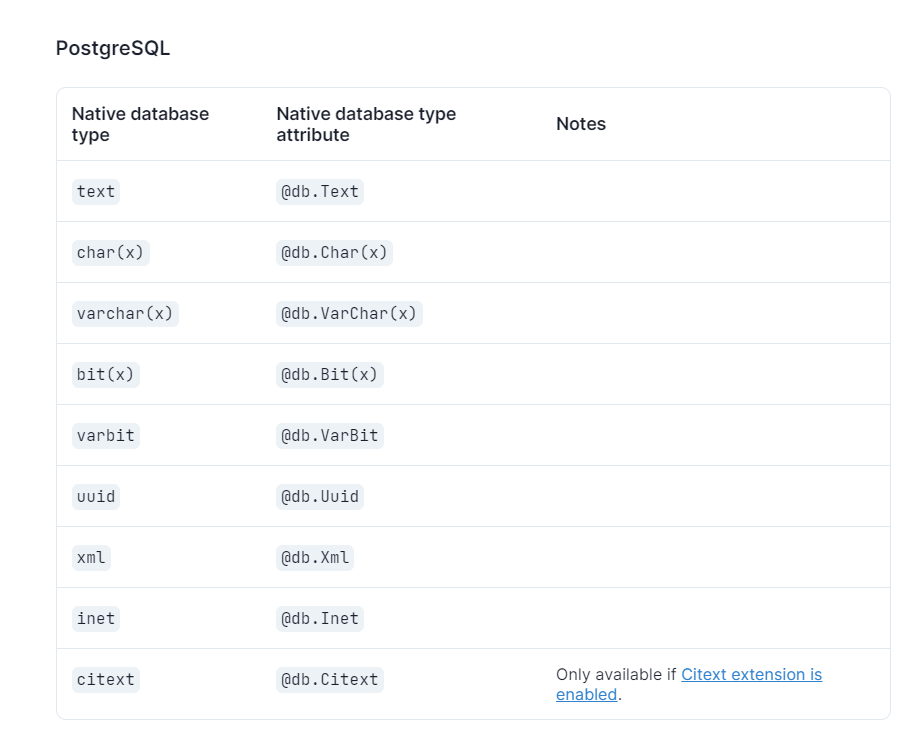

## Syntax

```
Examples:

model User {
  id      Int      @id @default(autoincrement())
  email   String   @unique
  name    String?
  role    Role     @default(USER)
  posts   Post[]
  profile Profile?
}
```

**@id**: Set as primary key

**@@id**: Set composite primary key
- e.g. @@id([id, email])
- Can be more than 2 fields
- To be placed at the bottom of the model
```
model User {
  id        Int     @default(autoincrement())
  firstName String
  lastName  String
  isAdmin   Boolean @default(false)

  @@id(fields: [firstName, lastName, isAdmin], name: "admin_identifier")
}

Only primitive values are allowed. So only String, Boolean, Int
```

**@default**: Set as default behaviour
- You can also set a default val e.g. @default("Hello")
- **autoincrement()**: Auto increment id automatically when a new record is inserted
- **now()**: Set the field to be the current time when a new record is inserted
- **uuid()**: Set the field to be a uuid when a new record is inserted
- **dbgenerated()**: Set the field to be generated by the database when a new record is inserted

**@unique**: Only unique values are allowed

**?**: Optional field

**[]**: Array of values, this field can contain multiple values or objects

**@relation**: Set up relation between models

**@map**: Map to a different name in the database

**@ignore**: Ignore this field

**@updatedAt**: Set the field to be updated when the record is updated


## More attributes


For more information: https://www.prisma.io/docs/orm/reference/prisma-schema-reference#dbgenerated


## How to model your data?

1. For each model that you create, it must have a @id, @id can be a string or an Int
2. If you are creating a one to one relationship, it does not matter which side you put the @relation
3. If you are creating a one to many relationship, the @relation should be on the many side
4. If you are creating a many to many relationship, there is no need for @relationship
5. If your model is referencing any model twice, you will need put a name to differentiate them
6. If you do not provide a @default value, please mark it with optional (if you want it to be optional)
    If you want validation safety for a field that is compulsory, then use that
7. Always create a separate Int/String Id field for every relationship and use that to mark the relationship between the model and the related model,
    The main id can be used but it is best to create another id to match as foreign key. An Id cannot be used twice.


## Error handling:

1. If you have a red underline in the repository, very likely you are missing some compulsory fields


## Issues to resolve:
1.  Data modelling: How do i manage all the different Ids? do i auto generate them? or do i not do anyting
2. for one to one relationship, one side requires a ? and the other is required, why is that?
